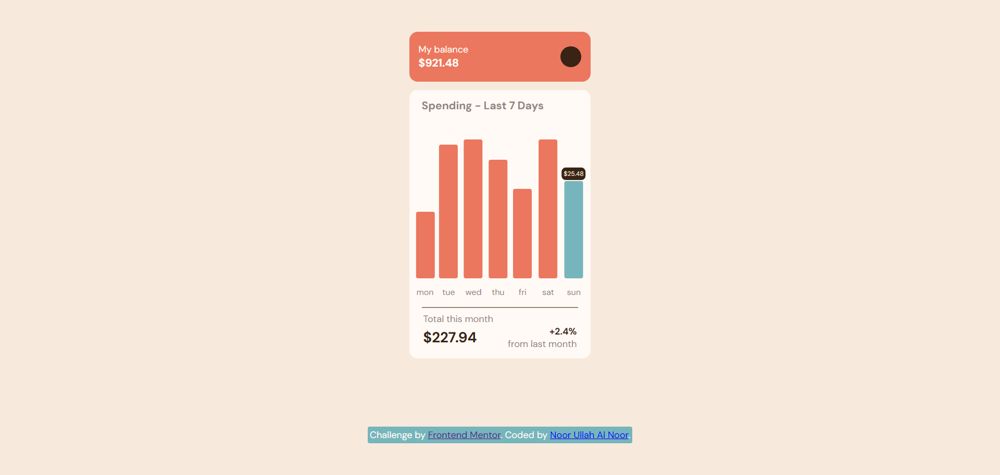
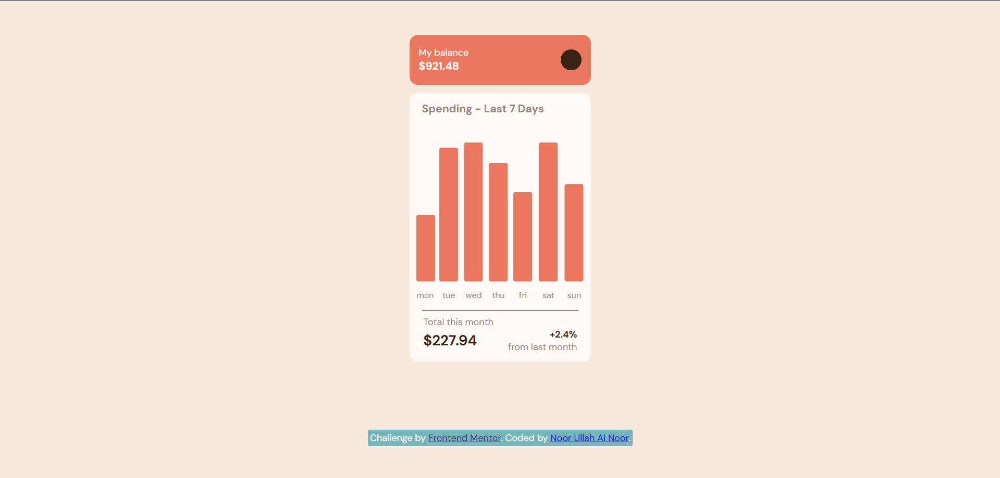

# Frontend Mentor - Expenses chart component solution

This is a solution to the [Expenses chart component challenge on Frontend Mentor](https://www.frontendmentor.io/challenges/expenses-chart-component-e7yJBUdjwt). 
## Table of contents

- [Overview](#overview)
  - [The challenge](#the-challenge)
  - [Screenshot](#screenshot)
  - [Links](#links)
- [My process](#my-process)
  - [Built with](#built-with)
  - [What I learned](#what-i-learned)
  - [Continued development](#continued-development)
  - [Useful resources](#useful-resources)
- [Author](#author)
- [Acknowledgments](#acknowledgments)

## Overview

### The challenge

Users should be able to:

- View the bar chart and hover over the individual bars to see the correct amounts for each day
- See the current day’s bar highlighted in a different colour to the other bars
- View the optimal layout for the content depending on their device’s screen size
- See hover states for all interactive elements on the page
- **Bonus**: Use the JSON data file provided to dynamically size the bars on the chart

### Screenshots

### Active State


One of the challenge requirements was to implement hover states for each bar, this was done by using the standard css, the following method was:
```css
.parent element {
  visibility: hidden
}
.parent:hover element {
  visibility:visible;
}
```
### Desktop



### Links

- Solution URL: [Github](https://github.com/TheDrifter408/expenses-chart-component)
- Live Site URL: [Vercel](https://expenses-chart-component-lemon.vercel.app/)

## My process

### Built with

- Semantic HTML5 markup
- CSS custom properties
- Flexbox
- CSS Grid
- Mobile-first workflow
- [React](https://reactjs.org/) - JS library

**Note: These are just examples. Delete this note and replace the list above with your own choices**

### What I learned

I learned to make the chart dynamic enough for in react component, through passing props, this time I used a simple function to calculate the total and find out the max amount from the `data.json`. The function is:
```js
 function getMax(data:DataType[]){
    let max = 0;
    let total = 0;
    for(const day of data){
        total += day.amount;
        if(max < day.amount){
            max = day.amount
        }
    }
    if(max > 50){
        max -= 20;
    }
    return {data,max,total};
}
```
The need to substract 20 from the max is to ensure at all that the max height does not skewer too much but this is not a good solution as it will give unsatisfactory if a different set of data is passed to it, suppose if the amounts exceed more than 100 or a 1000 in something.

### Areas I want to focus on
I would want to focus on making the page as responsive as possible and properly use `background-image` properly in css to make it properly look like the main content is hovering on it.


### Useful resources

- [Tooltip on hover](https://www.youtube.com/watch?v=UW5K0czLisc) - This helped me for making a simple tooltip through css and only a bit of html.

## Author

- Frontend Mentor - [@TheDrifter408](https://www.frontendmentor.io/profile/TheDrifter408)
